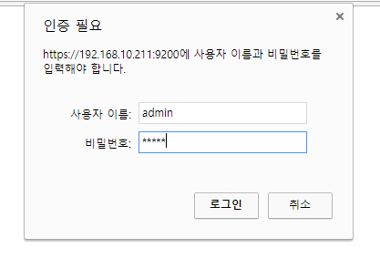

# Search Guard

인증을 위해 Search Guard 플러그인을 적용한 ELK 구성

## Elasticsearch에 Search Guard 설치

1. install 명령

   ```shell
   $ bin/elasticsearch-plugin install -b com.floragunn:search-guard-5:5.5.0-14
   ```

   - 버전은 아래 버전표 참고

2. tools 디렉토리로 이동

   ```shell
   $ cd <Elasticsearch directory>/plugins/search-guard-<version>/tools
   ```

3. install_demo_configuration.sh 실행

   ```shell
   $ ./install_demo_configuration.sh
   ```

   - 실행권한이 없는 경우 `chmod +x install_demo_configuration.sh`
   - 실행 후 truststore, keystore, kirk 인증서 파일이 생성됨
     - `<Elasticsearch directory>/config` 디렉토리에 생성됨
     - truststore.jks : root CA와 intermediate/signing CA
     - keystore.jks : 노드 인증서(node certificate)
     - install_demo_configuration.sh를 통해 생성된 인증서 파일들은 미리 생성해놓은 키값을 사용하기 때문에 보안에 취약하므로 production 서비스에서 사용할 경우에는 keystore와 truststore를 생성하여 사용할 것을 권장.

4. elasticsearch 실행

   ```shell
   $ <Elasticsearch directory>/bin/elasticsearch
   ```

   * elasticsearch가 실행 된 후 아래 sgadmin 스크립트를 실행 시켜주어야 Search Guard를 사용하기 위해 필요한 데이터들이 elasticsearch에 생성된다.

5. sgadmin_demo.sh 실행

   ```shell
   $ cd <Elasticsearch directory>/plugins/search-guard-<version>/tools
   $ ./sgadmin_demo.sh
   ```

   - 권한 설정이나 SearchGuard에 대한 설정 파일들은 `plugins/search-guard-<version>/sgconfig` 디렉토리에 생성됨

   - elasticsearch의 설정에 따라 ip와 port가 localhost의 9300이 아닌 경우에는 sgadmin_demo.sh 파일을 수정하여 호스트와 포트를 지정한다.'

     ```shell
     $ <Elasticsearch directory>/plugins/search-guard-5/tools/sgadmin.sh -cn searchguard_demo -h localhost -p 9300 -cd <Elasticsearch directory>/plugins/search-guard-5/sgconfig -ks <Elasticsearch directory>/config/kirk.jks -ts <Elasticsearch directory>/config/truststore.jks -nhnv
     ```

6. https://localhost:9200 으로 접속 확인

   * 인증 요청 팝업이 출력됨. (이 계정 정보는 sgconfig/sg_internal_user.xml에 정의)

     

   * 인증에 성공하면 아래와 같은 정보가 출력됨

     ```json
     {
       "name" : "9t6GokQ",
       "cluster_name" : "searchguard_demo",
       "cluster_uuid" : "itfKNEpHTZGSnbMuhj8ZrA",
       "version" : {
         "number" : "5.5.0",
         "build_hash" : "260387d",
         "build_date" : "2017-06-30T23:16:05.735Z",
         "build_snapshot" : false,
         "lucene_version" : "6.6.0"
       },
       "tagline" : "You Know, for Search"
     }
     ```

   ​


## Kibana에 Search Guard 설치

1. 플러그인 [다운로드](https://github.com/floragunncom/search-guard-kibana-plugin/releases)

   ```shell
   $ wget https://github.com/floragunncom/search-guard-kibana-plugin/releases/download/v5.4.2-3/searchguard-kibana-5.4.2-3.zip
   ```

2. 플러그인 설치

   ```shell
   $ bin/kibana-plugin install file:///usr/share/kibana/temp/searchguard-kibana-5.4.2-3.zip
   ```

3. /etc/kibana/kibana.yml 설정

   ```yaml
   elasticsearch.url: "https://localhost:9200"

   ... 생략 ...
   elasticsearch.username: "kibanaserver"
   elasticsearch.password: "kibanaserver"

   ... 생략 ...
   elasticsearch.ssl.verificationMode: none

   ... 생략 ...
   ```

   * elasticsearch URL은 이제 https를 사용
   * username과 password는 elasticsearch 쪽에 sgconfig/sg_internal_user.xml 파일에 지정된 계정을 사용
   * 사설 인증서를 사용하지 않으므로 verificationMode는 none으로 설정

4. http://localhost:5601 (키바나)로 접속

   

5. 브랜드 이미지를 변경하고 싶은 경우에는 config/kibana.yml에서 아래와 같이 설정

   ```
   searchguard.basicauth.login.showbrandimage: true
   searchguard.basicauth.login.brandimage: "이미지 경로"
   searchguard.basicauth.login.title: "로그인을 해주세요."
   searchguard.basicauth.login.subtitle: "서브 타이틀입니다."
   ```

6. 키바나 재시작 후 접속

   

   ​


## logstash 설정

1. logstash.conf 파일 작성

   ```ruby
   input {
     stdin {}
   }
   output {
     elasticsearch {
       hosts => "localhost:9200"
       user => logstash
       password => logstash
       ssl => true
       ssl_certificate_verification => false
       truststore => "<logstash path>/config/truststore.jks"
       truststore_password => changeit
       index => "test"
       document_type => "test_doc"
     }
     stdout{
       codec => rubydebug
     }
   }
   ```

   * user와 password는 elasticsearch의 Search Guard 플러그인에 등록된 유저 정보
     * 기본적으로 logstash 용으로 계정이 정의되어 있음.
   * ssl 설정을 true로 한 경우 ssl을 사용한다.
   * 인증서 파일을 사용하여 인증 절차를 수행하는 경우 ssl_certificate_verification을 true로 설정한다.
     * 여기서는 인증 절차를 수행하지 않기 때문에 false로 설정
     * true인 경우 truststore에 대한 설정을 해주어야 한다.


## 보충 설명

### elasticsearch.yml 설정

```yaml
http.host: 0.0.0.0

logger._root: DEBUG
######## Start Search Guard Demo Configuration ########
searchguard.ssl.transport.keystore_filepath: keystore.jks
searchguard.ssl.transport.truststore_filepath: truststore.jks
searchguard.ssl.transport.enforce_hostname_verification: false
searchguard.ssl.http.enabled: true
searchguard.ssl.http.keystore_filepath: keystore.jks
searchguard.ssl.http.truststore_filepath: truststore.jks
searchguard.authcz.admin_dn:
  - CN=kirk,OU=client,O=client,L=test, C=de

cluster.name: searchguard_demo
network.host: 0.0.0.0
######## End Search Guard Demo Configuration ########
```

- keystore/truststore 를 직접 생성하지 않고 이미 생성되어 있는 것을 사용하는 경우 아래 명령으로 인증 정보 확인

  ```shell
  $ keytool -list -v -keystore kirk.jks
  ```

  - install_demo_configuration.sh를 통해 생성된 kirk.jks 파일의 패스워드는 `changeit`

- 이 설정 값은 install_demo_configuration.sh 쉘스크립트를 실행하면 자동으로 추가된다.


### keystore/truststore 생성

자바에 포함된 보완관련 어플리케이션인 keytool을 사용

1. keystore 생성 (인증서)

   ```shell
   $ keytool -genkey -alias hive-key -keyalg RSA -keypass changeit -storepass changeit -keystore keystore.jks
   ```

2. 위에서 생성한 keystore.jks 인증서를 server.cer 파일로 내보냄

   ```shell
   $ keytool -export -alias hive-key -storepass changeit -file server.cer -keystore keystore.jks
   ```

3. truststore 파일을 만들고 인증서를 truststore에 추가

   ```shell
   $ keytool -import -v -trustcacerts -file server.cer -keystore truststore.jks -keypass changeit
   ```

4. keystore.jks와 trusstore.jks 생성 완료

   ```
   Owner: CN=yongho, OU=vinus, O=server, L=Seoul, ST=Samsung, C=16201
   Issuer: CN=yongho, OU=vinus, O=server, L=Seoul, ST=Samsung, C=16201
   Serial number: 3ee66345
   Valid from: Thu Jul 13 05:27:44 UTC 2017 until: Wed Oct 11 05:27:44 UTC 2017
   Certificate fingerprints:
            MD5:  58:DD:2D:D2:11:93:8C:E4:EF:96:4C:0F:8D:04:52:96
            SHA1: 93:5F:BD:68:04:6C:E6:CC:7A:DC:08:79:0D:EB:B4:C3:69:38:EF:A1
            SHA256: 57:FB:66:40:47:A0:6B:1A:96:4B:91:31:60:6C:51:F7:7E:2B:04:29:9A:EE:EE:8E:AB:5A:23:43:F3:4B:E4:83
            Signature algorithm name: SHA1withDSA
            Version: 3

   Extensions:

   #1: ObjectId: 2.5.29.14 Criticality=false
   SubjectKeyIdentifier [
   KeyIdentifier [
   0000: 33 4D 88 F3 C9 AC 12 DF   3F 92 1D 96 50 9C 36 2E  3M......?...P.6.
   0010: E4 11 2E 51                                        ...Q
   ]
   ]
   ```


### 사용자 관리

아래에서 사용되는 설정 파일들은 `<elasticsearch path>/plugins/search-guard-5/` 하위에 위치함.


#### 사용자 추가

1. sgconfig/sg_internal_users.yml 파일에 유저 추가

   ```yaml
   guest:
     hash:
     #password is: guest
   ```

2. tools/hash.sh를 사용하여 패스워드 생성

   ```shell
   $ sh hash.sh
   [Password:]
   $2a$12$izzerIN4R.m6nCDNuCPtWOR/6n/LBudgjPLBS1naNptyF2VuUPwfe
   ```

3. 생성된 해쉬코드를 복사하여 sgconfig/sg_internal_users.yml 파일에 추가

   ```yaml
   guest:
     hash: $2a$12$izzerIN4R.m6nCDNuCPtWOR/6n/LBudgjPLBS1naNptyF2VuUPwfe
     #password is: guest
   ```

4. tools/sgadmin_demo.sh 파일을 실행하여 변경된 사항 적용

   ```shell
   $ ./sgadmin_demo.sh
   ```


#### 권한 설정

1. 사용자에 대한 권한 role 이름을 sgconfig/sg_roles_mapping.xml 파일에 설정 하고, role 이름을 기반으로 사용자들을 해당 role에 추가시켜서 다수의 사용자들에게 동일한 role을 지정할 수 있다.

   * 기본적으로 prefix로 sg_가 붙음


   * 위에서 추가한 guest의 경우 sg_guest로 지정

     ```yaml
     sg_guest:
       uesrs:
         - guest
     ```

2. sgconfig/sg_roles.xml 파일 수정

   * 위에서 설정한 role 이름에 대한 권한을 지정한다.

   * 여기서는 guest로 들어온 경우 read only 권한을 부여

     ```yaml
     sg_guest:
       cluster:
         - UNLIMITED
       indices:
         '*':
           '*':
             - READ
     ```

   * 대문자로 표시되어 있는 값들은 sgconfig/sg_action_groups.yml 파일에 정의되어 있다.

     * 위에 설정한 READ의 경우 아래와 같이 설정됨

       ```yaml
       READ:
         - "indices:data/read*"
         - "indices:admin/mappings/fields/get*"
       ```

3. 변경된 사항을 적용하기 위해 tools/sgadmin_demo.sh 실행

   ```shell
   $ ./sgadmin_demo.sh
   ```


## 트러블슈팅

### zen_unicast 관련 에러

```
[2017-07-13T06:04:03,175][ERROR][c.f.s.t.SearchGuardRequestHandler] Error validating headers
[2017-07-13T06:04:03,191][WARN ][o.e.d.z.UnicastZenPing   ] [vOvmwD5] [1] failed send ping to {#zen_unicast_127.0.0.1:9300_0#}{UV7v4BgFTaSO3E3F6Ng2DQ}{127.0.0.1}{127.0.0.1:9300}
java.lang.IllegalStateException: handshake failed with {#zen_unicast_127.0.0.1:9300_0#}{UV7v4BgFTaSO3E3F6Ng2DQ}{127.0.0.1}{127.0.0.1:9300}
        at org.elasticsearch.transport.TransportService.handshake(TransportService.java:386) ~[elasticsearch-5.4.3.jar:5.4.3]
        at org.elasticsearch.transport.TransportService.handshake(TransportService.java:353) ~[elasticsearch-5.4.3.jar:5.4.3]
        at org.elasticsearch.discovery.zen.UnicastZenPing$PingingRound.getOrConnect(UnicastZenPing.java:401) ~[elasticsearch-5.4.3.jar:5.4.3]
        at org.elasticsearch.discovery.zen.UnicastZenPing$3.doRun(UnicastZenPing.java:508) [elasticsearch-5.4.3.jar:5.4.3]
        at org.elasticsearch.common.util.concurrent.ThreadContext$ContextPreservingAbstractRunnable.doRun(ThreadContext.java:638) [elasticsearch-5.4.3.jar:5.4.3]
        at org.elasticsearch.common.util.concurrent.AbstractRunnable.run(AbstractRunnable.java:37) [elasticsearch-5.4.3.jar:5.4.3]
        at java.util.concurrent.ThreadPoolExecutor.runWorker(ThreadPoolExecutor.java:1142) [?:1.8.0_131]
        at java.util.concurrent.ThreadPoolExecutor$Worker.run(ThreadPoolExecutor.java:617) [?:1.8.0_131]
        at java.lang.Thread.run(Thread.java:748) [?:1.8.0_131]
```

* conf/elasticsearch.yml 설정에서 network.publish_host와 network.bind_host가 모두 설정되어 있는 경우 network.publish_host 설정을 제거하면 해결됨

  ```yaml
  cluster.name: mycluster
  node.master: true
  node.data: true
  discovery.zen.ping.multicast.enabled: false
  number_of_nodes : 1
  minimum_master_nodes: 1
  path.logs: .
  node.name: ElasticStack.0.0.0.0
  # network.publish_host: 0.0.0.0
  network.bind_host: "0.0.0.0"
  ... 생략 ...
  ```

* 참고

  * https://discuss.elastic.co/t/elasticsearch-failed-to-send-ping-error/55125/4


### Someone (/172.19.0.8:38490) speaks http plaintext instead of ssl, will close the channel

* Search Guard 사용 시 http 통신 또한 ssl로 사용하도록 설정해둔 경우 기존에 http를 사용하여 logstash나 kibana를 사용하고 있었기 때문에 이 통신이 https가 아니라는 오류가 출력된다.

* logstash나 kibana에 https로 통신을 하도록 설정하던가 https 통신을 사용하지 않도록 설정하도록 함.

* 여기서는 https 통신을 사용하지 않는 것으로 설정

* conf/elasticsearch.yml 파일 수정

  ```yaml
  ... 생략 ...
  searchguard.ssl.http.enabled: false
  searchguard.ssl.http.keystore_filepath: /usr/share/elasticsearch/config/keystore.jks
  searchguard.ssl.http.keystore_password: changeit
  searchguard.ssl.http.truststore_filepath: /usr/share/elasticsearch/config/truststore.jks
  searchguard.ssl.http.truststore_password: changeit
  ... 생략 ...
  ```

  * searchguard.ssl.http.enabled을 false로 설정


### Not yet initialized 에러

```
[2017-07-14T10:23:06,639][INFO ][c.f.s.c.IndexBaseConfigurationRepository] searchguard index does not exist yet, so no need to load config on node startup. Use sgadmin to initialize cluster
[2017-07-14T10:23:06,639][INFO ][o.e.g.GatewayService     ] [9t6GokQ] recovered [0] indices into cluster_state
[2017-07-14T10:23:08,171][ERROR][c.f.s.a.BackendRegistry  ] Not yet initialized (you may need to run sgadmin)
[2017-07-14T10:23:08,200][ERROR][c.f.s.a.BackendRegistry  ] Not yet initialized (you may need to run sgadmin)
[2017-07-14T10:23:10,708][ERROR][c.f.s.a.BackendRegistry  ] Not yet initialized (you may need to run sgadmin)
[2017-07-14T10:23:13,212][ERROR][c.f.s.a.BackendRegistry  ] Not yet initialized (you may need to run sgadmin)
[2017-07-14T10:23:15,714][ERROR][c.f.s.a.BackendRegistry  ] Not yet initialized (you may need to run sgadmin)
```

* 키바나에서 연결 요청을 하는 경우 위와 같은 에러 발생

* Search Guard 플러그인에 대한 초기 설정이 제대로 이루어지지 않아서 발생하는 에러이다.

* 이는 sgadmin_demo.sh 실행이 실패했다는 것을 의미한다.

* 실패한 경우를 보면 아래와 같다.

  ```shell
  $ ./sgadmin_demo.sh
  Search Guard Admin v5
  Will connect to localhost:9300
  ERR: Seems there is no elasticsearch running on localhost:9300 - Will exit
  ```

  * 여기서는 elasticsearch에 접속하지 못해서 발생하는 에러였는데 실제로 elasticsearch가 구동 중이지 않거나 host 또는 port가 맞지 않았기 때문에 발생하였다.
  * host와 port가 맞지 않은 경우 sgadmin_demo.sh 파일을 수정하여 호스트와 포트를 지정

* 정상적인 경우에는 아래와 같은 메시지가 출력된다.

  ```shell
  Search Guard Admin v5
  Will connect to 192.168.10.211:9300 ... done

  ### LICENSE NOTICE Search Guard ###

  If you use one or more of the following features in production
  make sure you have a valid Search Guard license
  (See https://floragunn.com/searchguard-validate-license)

  * Kibana Multitenancy
  * LDAP authentication/authorization
  * Active Directory authentication/authorization
  * REST Management API
  * JSON Web Token (JWT) authentication/authorization
  * Kerberos authentication/authorization
  * Document- and Fieldlevel Security (DLS/FLS)
  * Auditlogging

  In case of any doubt mail to <sales@floragunn.com>
  ###################################
  Contacting elasticsearch cluster 'searchguard_demo' and wait for YELLOW clusterstate ...
  Clustername: searchguard_demo
  Clusterstate: GREEN
  Number of nodes: 1
  Number of data nodes: 1
  searchguard index does not exists, attempt to create it ... done (auto expand replicas is on)
  Populate config from /home/hive/elk-test/elasticsearch-5.5.0/plugins/search-guard-5/sgconfig/
  Will update 'config' with /home/hive/elk-test/elasticsearch-5.5.0/plugins/search-guard-5/sgconfig/sg_config.yml
     SUCC: Configuration for 'config' created or updated
  Will update 'roles' with /home/hive/elk-test/elasticsearch-5.5.0/plugins/search-guard-5/sgconfig/sg_roles.yml
     SUCC: Configuration for 'roles' created or updated
  Will update 'rolesmapping' with /home/hive/elk-test/elasticsearch-5.5.0/plugins/search-guard-5/sgconfig/sg_roles_mapping.yml
     SUCC: Configuration for 'rolesmapping' created or updated
  Will update 'internalusers' with /home/hive/elk-test/elasticsearch-5.5.0/plugins/search-guard-5/sgconfig/sg_internal_users.yml
     SUCC: Configuration for 'internalusers' created or updated
  Will update 'actiongroups' with /home/hive/elk-test/elasticsearch-5.5.0/plugins/search-guard-5/sgconfig/sg_action_groups.yml
     SUCC: Configuration for 'actiongroups' created or updated
  Done with success
  ```


## 참고

* [Search Guard 구축 가이드](http://www.popit.kr/search-guard%EB%A1%9C-es-%ED%82%A4%EB%B0%94%EB%82%98-%EC%9D%B8%EC%A6%9D-%EA%B5%AC%EC%B6%95/)
* [Search Guard 버전표](https://github.com/floragunncom/search-guard/wiki)
* [Search Guard 다운로드](https://oss.sonatype.org/content/repositories/releases/com/floragunn/search-guard-5/)
* [keystore/truststore 생성](https://docs.oracle.com/cd/E19159-01/820-4605/ablrb/index.html)
* [Secure Guard 설정 참고](https://github.com/floragunncom/search-guard/issues/136)
* [SSL 이론 설명](http://btsweet.blogspot.kr/2014/06/tls-ssl.html)
* [Search Guard logstash 설정](https://github.com/floragunncom/search-guard-docs/blob/master/logstash.md)
* [Search Guard Transport Client 설정](https://floragunn.com/searchguard-elasicsearch-transport-clients/)
